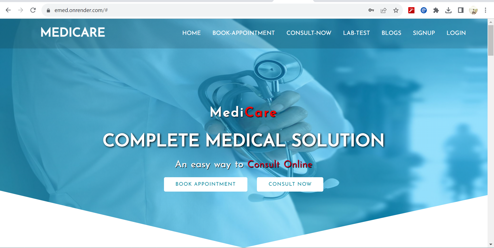

# MediCare (E-Consultant with Doctors)

E-Consultant with Doctors is an online platform that enables users to consult with doctors. It offers various features, such as Gmail login, Paytm payment services, email functionality for booking and payment-related notifications, and video calling using WebSockets.

## Table of Contents

- [Technologies Used](#technologies-used)
- [Installation](#installation)
- [Demo Video](#demo-video)
- [Visit our site](#visit-our-site)

## Technologies Used

- **Node.js**
- **JavaScript**
- **Express**
- **MongoDB**
- **WebSockets**

## Installation

Follow these steps to set up the project on your local machine:

1. **Clone the repository**: Use the following command to clone the project from the repository.

   ```bash
   git clone git@github.com:Impachouri/E-Medical-Solution.git
   ```

2. **Navigate to the project directory**:

   ```bash
   cd ./E-Medical-Solution/
   ```

3. **Environment Variable Configuration**:

   ```env
   PAYTM_MID=your-paytm-merchant-id
   PAYTM_KEY=your-paytm-merchant-key
   PAYTM_WEBSITE=WEBSTAGING
   SESSION_SECRET=your-session-secret
   MONGO_URL=your-mongo-db-connection-url
   CLIENT_ID=your-google-oauth-client-id
   CLIENT_SECRET=your-google-oauth-client-secret
   GMAIL_ACCOUNT=your-gmail-account
   GMAIL_PASSWORD=your-gmail-password
   SERVER=http://localhost:8000
   ```

4. **Start the project using npm**:
   ```bash
   npm run start
   ```

## Demo Video

Video

[](https://www.veed.io/view/6150f1e8-85e6-48eb-a6dd-9f1ed88e8bf9?panel=share)

## Visit site

[MediCare](https://emed.onrender.com/)
